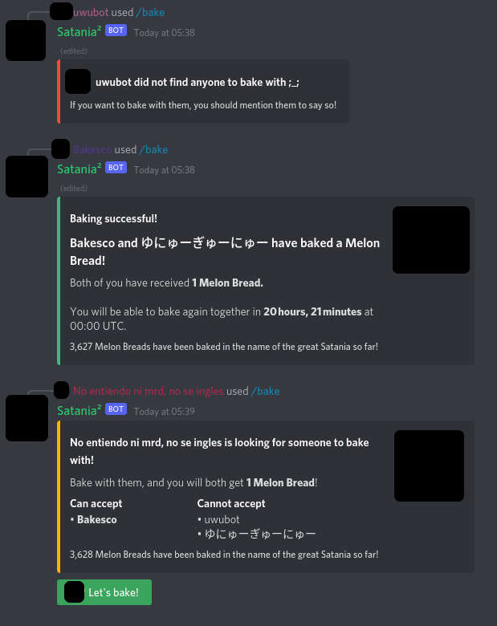
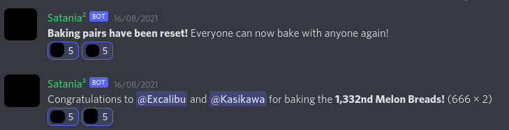

# Satania Dropout melon bread baking event bot

This is the code used to run the annual melon bread baking event on Satania Dropout.

Here is how the game works:

- Users can use a command, `/bake`, to start a baking invitation.
- When someone else accepts the invitation, they both get 1 melon bread, but they cannot bake together for the rest of the day.
- The goal is to bake with as many people as possible to get as many melon breads as possible.



Copyrighted images are blacked out on this screenshot.

This is a Node.JS application made with TypeScript. It was ported to Discord.JS v13 (latest version as of August 2021).

Feel free to contact me at Pizzacus#2884 for help running this bot.

## Features

- It supports slash commands, which helps the game a lot by reducing spam. The message that used `/bake` is not displayed and alerts about things like not being able to bake with someone are only displayed to the user involved. Before the introduction of slash commands, they were displayed to everyone, which made the game look quite chaotic.
- The bot indicates on each invitation who can or cannot accept it among the active users. This allows people to quickly identify whether they can accept an invitation. The list is also sorted alphabetically so you can spot your name easily.
- There's a global counter of the total amount of melon breads baked during the event. I think this encourages people to see the event as a cooperative effort.
- (Optional) Milestones and resets can be announced in a dedicated channel, you can decide which numbers are milestones and add a comment with them.
- (Optional) The bot can give a role to everyone who participates in the event, as soon as they successfully bake a melon bread.



We set these messages to be posted in our #announcements channel. That way people who aren't playing can still see how the game is evolving, 

## Running the bot

Make sure you're at least on Node v14 (the LTS as of August 2021). You can check with `node -v`.

First, [set up your bot application](https://discordjs.guide/preparations/setting-up-a-bot-application.html) and [add it to the server](https://discordjs.guide/preparations/adding-your-bot-to-servers.html)

You will also need to enable the "Server members intent" in "Privileged Gateway Intents" so that the bot can get member data. You can find this in [Your application](https://discord.com/developers/applications) → Bot → Privileged Gateway Intents. 

Then:

```bash
# 1. Clone this repository
git clone https://github.com/Pizzacus/melon-bread-event
cd melon-bread-event

# 2. Install dependencies 
npm install # OR
yarn # OR
pnpm install

# 3. Copy `config.sample.toml` to `config.toml` (Keep the original for reference)
cp config.sample.toml config.toml

# 4. Fill in the `config.toml` file as explained by the comments in it.

# 5. Register the `/bake` command on Discord.
npm run command register # OR
yarn command register # OR
pnpm command register

# 6. The ID of your command will be shown, add it to the `config.toml` file.
npm run start # OR
yarn start # OR
pnpm start
```

Then the bot should be running and you can start baking!

## Generating a leaderboard

```bash
# Generate a leaderboard and print it to the terminal
npm run leaderboard # OR
yarn leaderboard # OR
pnpm leaderboard

# Write it to a file with Bash (mostly Linux and Mac)
npm run leaderboard > leaderboard.md # OR
yarn leaderboard > leaderboard.md # OR
pnpm leaderboard > leaderboard.md

# Write it to a file with PowerShell (mostly Windows)
npm run leaderboard | Out_File -Path leaderboard.md # OR
yarn leaderboard | Out_File -Path leaderboard.md # OR
pnpm leaderboard | Out_File -Path leaderboard.md
```

The table will be in the Markdown format, you can post it on a service that supports Markdown, such as [GitHub Gist](https://gist.github.com).


If you didn't note the ID of the command when you ran `pnpm command register`, you can see it again with `pnpm command list`, which lists the IDs of the commands your bot has on the server.

## Running in production

When you do the event for real, it's likely the bot will eventually crash. I did my best to avoid this, but there could be issues remaining. The Discord API itself is prone to errors, so it's very hard to make a totally uncrashable bot.

So instead, you should make sure the bot can recover from crashes. Either keep an eye on it or use a process manager like pm2 top restart it automatically. 

Here's how you can do that with, for instance, [pm2](https://pm2.keymetrics.io/):

```bash
# 1. Install pm2, you may have to use `sudo` on Linux
npm install -g pm2 # OR
yarn global add pm2 # OR
pnpm add -g pm2

# 2. Compile the TypeScript into JavaScript that pm2 can run
npm run build # OR
yarn build # OR
pnpm build

# 3. Start the bot, this will close immediately because it will be running in the background
pm2 start dist/bot.js
```

How to use pm2:

```bash
# See the running scripts
pm2 list

# See the logs of the bot
pm2 logs bot

# Stop the bot
pm2 stop bot

# Restart the bot
pm2 restart bot
```

If you modify the config, you can just do `pm2 restart bot` to apply the changes, but if you modify the code, you must run `pnpm build` (or the equivalent) first.

## Other useful things

```
# List commands (if you forgot to write the ID)
npm run command list # OR
yarn command list # OR
pnpm command list

# Delete the command (run this at the end of the event)
npm run command delete # OR
yarn command delete # OR
pnpm command delete
```

## Limitations

- The bot can only be used on one server at a time.
- The bot can only work in one channel.
- the bot can only listen to one command at a time (no aliases).
- If `x` and `y` send an invite, and `y` accepts `x`'s invite, `y`'s invite will be outdated as `x` will still show up in the list of people who can accept `y` it.
- There is no way for people to check how many melon breads they have baked until the end of the event, but that is on purpose to maintain suspense.
- Sharding is not supported, you cannot run this script if your bot is on over 2,500 servers, as sharding is mandatory past this stage.
- Bots cannot bake because they cannot use slash commands. When we didn't have slash commands, you could trick them into baking if they had an echo command. People were pretty sad that this was no longer the case.

## Licence

*(No, not a mistake, in Europe, the noun is spelt 'licence' and the verb 'license')*

This work is released as [free software](https://www.gnu.org/philosophy/free-sw.en.html) under the terms of the MIT licence, a copy of which has been included under `LICENSE.md`.

`README_announcements.png` and `README_baking.png` are screenshots from Discord. Although some copyrighted elements were removed, they may still infringe on Discord's rights. This depends on whether the elements depicted from Discord would be deemed to pass the [threshold of originality](https://en.wikipedia.org/wiki/Threshold_of_originality), which depends on the jurisdiction and is a hard question to answer in this case.

Because of that, it is possible that certain rights on these files cannot be licensed here.